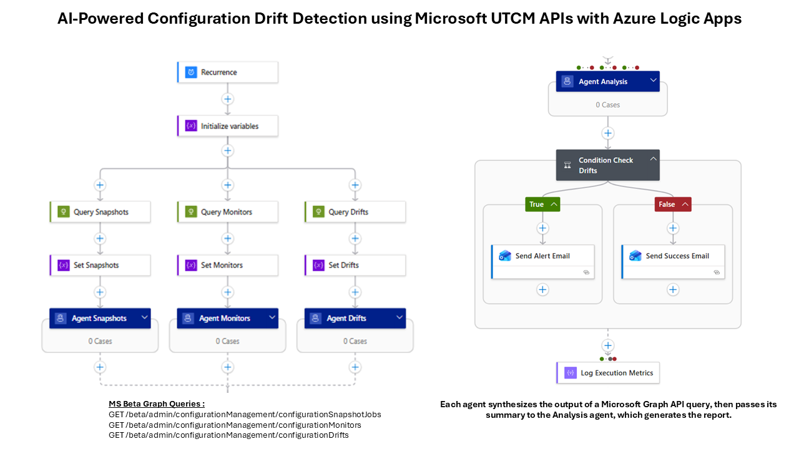
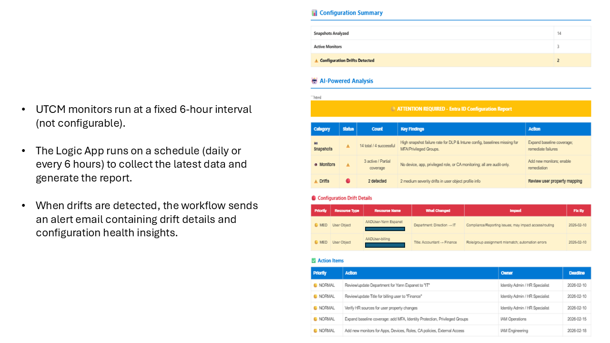

# UTCM Configuration Drift Monitor

> **⚠️ SECURITY WARNING**  
> This repository contains deployment templates with placeholder values. **NEVER commit real secrets, API keys, or credentials to source control.**  
> Use Azure Key Vault for production deployments. See [DEPLOYMENT.md](DEPLOYMENT.md) for secure deployment instructions.

Automated Azure Logic App for monitoring Microsoft Entra ID configuration drift using UTCM (Unified Tenant Configuration Management) APIs with AI-powered analysis.

## 📸 Solution Overview


*Architecture diagram showing the Logic App workflow with parallel API queries, multi-agent AI analysis, and automated email reporting*

## 📧 Example Email Reports

### Configuration Drift Alert

*Alert email sent when configuration drifts are detected with detailed AI analysis and remediation recommendations*

## 🎯 Features

- **Parallel API Queries**: Simultaneously fetches snapshots, monitors, and drifts
- **AI-Powered Analysis**: Uses GPT-4 and GPT-4o-mini for intelligent insights
- **Multi-Agent Architecture**: Specialized agents for different data types
- **Executive Synthesis**: Combines all analyses into actionable reports
- **Professional Email Reports**: HTML-formatted emails with conditional alerting
- **Zero-Drift Success Messages**: Celebrates compliance when no issues detected
## 📚 What is UTCM?

**Unified Tenant Configuration Management (UTCM)** is Microsoft's API framework for monitoring and managing configuration baselines across Microsoft Entra ID (formerly Azure AD). UTCM enables organizations to:

- **Create Configuration Snapshots**: Capture baseline configurations of policies, conditional access, and security settings
- **Monitor Continuously**: Automatically detect when actual configurations drift from approved baselines
- **Track Changes**: Identify what changed, when it changed, and assess compliance impact
- **Maintain Compliance**: Ensure configurations align with organizational security policies

> ⏱️ **Important**: UTCM monitors run at a fixed **6-hour interval** (not configurable). The Logic App can run **daily** or **every 6 hours** depending on your reporting needs.

### UTCM APIs Used
This solution leverages three Microsoft Graph Beta endpoints:
- `/admin/configurationManagement/configurationSnapshotJobs` - Baseline snapshots
- `/admin/configurationManagement/configurationMonitors` - Active monitoring rules
- `/admin/configurationManagement/configurationDrifts` - Detected configuration changes

## 💡 Who Benefits from This Solution?

- **Security Teams**: Proactive alerts when security configurations drift from approved baselines
- **Compliance Officers**: Automated evidence of configuration compliance for audits
- **IT Administrators**: Reduce manual monitoring with AI-powered drift analysis
- **Managed Service Providers (MSPs)**: Monitor multiple client tenants with consolidated reporting
- **DevOps Teams**: Integrate configuration monitoring into CI/CD pipelines
## � Quick Start

Get up and running in **15 minutes**:

1. **Create Azure Resources**: Resource Group, Key Vault, Logic App (Consumption)
2. **Register App**: Create Entra ID App Registration with UTCM permissions (see below)
3. **Store Secret**: Save client secret in Key Vault
4. **Deploy**: Run `deployment/deploy-secure.ps1` PowerShell script
5. **Authorize**: Approve Office 365 connection in Azure Portal
6. **Test**: Trigger Logic App manually to verify email delivery

> 💡 **Recommended**: Use the automated deployment script for secure Key Vault integration. See [DEPLOYMENT.md](DEPLOYMENT.md) for detailed instructions.

## 📊 Architecture

```
Trigger (Daily/6hr) → Query UTCM APIs (Parallel) → AI Analysis (Multi-Agent) → Synthesize → Email Report
```

### Multi-Agent Architecture:

| Agent | Model | Purpose | Output |
|-------|-------|---------|--------|
| **Snapshot Agent** | GPT-4o-mini | Analyzes baseline snapshots | Coverage assessment, reliability concerns |
| **Monitor Agent** | GPT-4o-mini | Analyzes active monitors | Strategic insights, coverage scoring |
| **Drift Agent** | GPT-4o-mini | Analyzes configuration drifts | Severity classification, remediation plans |
| **Analysis Agent** | GPT-4o | Executive synthesis | Compact table-based executive summary |

### Workflow Steps:
1. **Initialize Variables**: Creates arrays for snapshots, monitors, and drifts
2. **Query UTCM APIs**: Fetches data from Microsoft Graph (parallel execution)
3. **AI Analysis**: Three specialized agents analyze each data type simultaneously
4. **Executive Synthesis**: GPT-4o combines findings into scannable report
5. **Conditional Alerting**: Sends alert (drifts detected) or success (compliant) email

## 🚀 Prerequisites

- **Azure subscription** with permissions to create resources
- **Azure Logic Apps** (Consumption tier - includes built-in AI Agent actions with Azure OpenAI)
  - ℹ️ **No separate Azure OpenAI deployment needed** - Logic Apps Agent actions are built-in
- **Microsoft 365 / Office 365** connection for email delivery
- **Azure Key Vault** for secure secret storage (recommended)
- **Entra ID App Registration** with Microsoft Graph API permissions:
  - `ConfigurationSnapshot.Read.All` - Read configuration snapshot jobs
  - `ConfigurationMonitor.Read.All` - Read active monitoring configurations
  - `ConfigurationDrift.Read.All` - Read detected configuration drifts
  - `Directory.Read.All` (optional) - Additional directory context
  - `Policy.Read.All` (optional) - Policy configuration details

## 📦 Deployment

### Option 1: Azure Portal (Manual)

1. Create a new Logic App
2. Import `logic-app/workflow.json`
3. Configure parameters:
   - `tenantId`: Your Azure AD tenant ID
   - `clientId`: App registration client ID
   - `clientSecret`: Client secret (store in Key Vault recommended)
   - `emailRecipient`: Email address for reports
4. Configure Office 365 connection
5. Enable and test

### Option 2: ARM Template (Automated)

⚠️ **Security Note:** Never commit `azuredeploy.parameters.json` with real secrets. Use Key Vault references or command-line parameters.

```bash
# Copy the example parameters file
cp deployment/azuredeploy.parameters.example.json deployment/azuredeploy.parameters.json

# Edit with your values (keep this file local, never commit it)
# Then deploy:
az deployment group create \
  --resource-group <your-rg> \
  --template-file deployment/azuredeploy-simple.json \
  --parameters deployment/azuredeploy.parameters.json
```

## ⚙️ Configuration

### Required Parameters

| Parameter | Type | Description | Example |
|-----------|------|-------------|----------|
| tenantId | string | Azure AD Tenant ID | `8c821cde-...` |
| clientId | string | Application (client) ID | `61f2fe1c-...` |
| clientSecret | securestring | Client secret from Key Vault | (stored securely) |
| emailRecipient | string | Report recipient email | `admin@example.com` |
| office365ConnectionId | string | Office 365 connection resource ID | `/subscriptions/.../connections/office365` |

### AI Models Used (Built-in to Logic Apps)
- **gpt-4o**: Executive synthesis agent - creates compact executive summaries
- **gpt-4o-mini**: Three specialized agents - snapshot, monitor, and drift analysis

> ℹ️ These AI models are **built into Logic Apps Agent actions** - no separate Azure OpenAI deployment or configuration required.

## 📧 Email Reports

### Alert Email (Drifts Detected)
- **Subject**: 🚨 URGENT: Configuration Drifts Detected - X Issue(s)
- **Priority**: High
- **Content**: Detailed analysis with remediation recommendations

### Success Email (No Drifts)
- **Subject**: ✅ Configuration Status: All Systems Compliant
- **Priority**: Normal
- **Content**: Compliance confirmation with baseline status

## 🔐 Security Best Practices

- **Never commit secrets**: Use parameters and Key Vault
- **Use Managed Identity**: Recommended over client secrets for production
- **Rotate credentials**: Regularly rotate client secrets (use Key Vault references for easy rotation)
- **Least privilege**: Grant minimum required permissions
- **Audit logs**: Monitor Logic App execution history
- **Secure deployment**: Use the provided [deployment scripts](DEPLOYMENT.md) that store secrets in Key Vault
- **`.gitignore` configured**: `azuredeploy.parameters.json` is excluded from version control

## 📝 License

MIT License - see LICENSE file

## 🤝 Contributing

Contributions welcome! Please:

1. Fork the repository
2. Create a feature branch
3. Submit a pull request

## 📖 Documentation

- **[DEPLOYMENT.md](DEPLOYMENT.md)** - Detailed deployment instructions and troubleshooting
- **[LICENSE](LICENSE)** - MIT License terms

## 🐛 Known Issues

- **Beta APIs**: UTCM APIs are in beta and subject to change without notice
- **6-Hour Monitor Interval**: UTCM monitors run every 6 hours (not configurable by users)
- **Partial Snapshots**: Partial snapshot success may indicate insufficient API permissions
- **Office 365 Authorization**: Requires manual authorization in Azure Portal after deployment
- **Region Availability**: UTCM APIs may have regional availability limitations

## 📞 Support

For issues or questions:

- Open a GitHub issue

## 🙏 Acknowledgments

- Microsoft Graph UTCM APIs
- Azure OpenAI Service
- Azure Logic Apps

---

⚠️ **Important**: This solution queries beta Microsoft Graph APIs. Monitor the Microsoft Graph changelog for updates.
